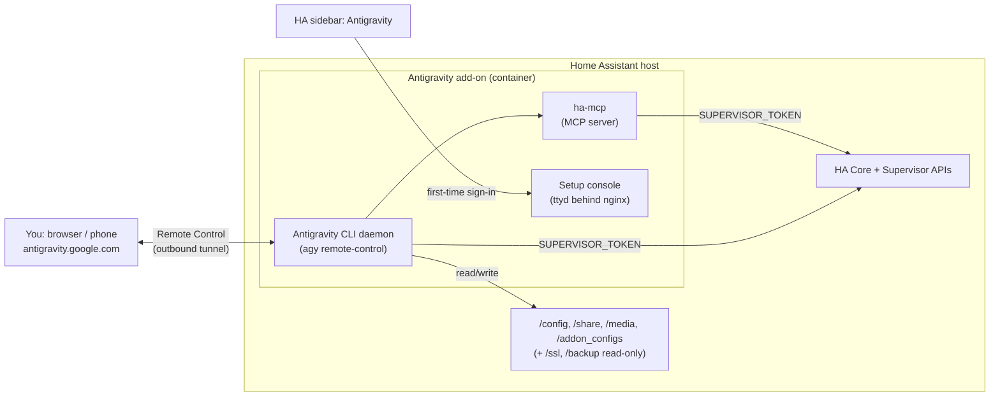

<p align="center">
  <picture>
    <source media="(prefers-color-scheme: dark)" srcset="images/antigravity-lockup-dark.svg">
    
  </picture>
</p>

<h1 align="center">Antigravity for Home Assistant</h1>

<p align="center">
  Run the <a href="https://antigravity.google">Google Antigravity</a> coding agent <b>on your Home Assistant host</b>
  and drive it from any browser, including your phone, with
  <a href="https://antigravity.google/docs/remote-control">Antigravity Remote Control</a>.
</p>

<p align="center">
  <a href="https://my.home-assistant.io/redirect/supervisor_add_addon_repository/?repository_url=https%3A%2F%2Fgithub.com%2Foded996%2Fantigravity-home-assistant-addons"></a>
</p>

<p align="center">
  
  
</p>

---

## Why this add-on?

Existing AI add-ons for Home Assistant give you a coding agent inside a **web terminal**. That works, but it's awkward on a phone, diffs are hard to read, and approving changes is fiddly.

This add-on works differently. There's **no terminal UI to use day-to-day**:

- The Antigravity CLI runs as an **always-on headless daemon** inside the add-on, with direct access to your Home Assistant configuration.
- You work with it from **https://antigravity.google.com**, the same Antigravity interface you'd use for a desktop session. That gives you conversations, implementation plans, artifacts, diff review and tool approvals, on desktop or mobile. You can install the site as a web app to get push notifications when the agent finishes or needs input.
- The agent has **native Home Assistant tools** through the bundled [ha-mcp](https://github.com/homeassistant-ai/ha-mcp) MCP server, plus the Core and Supervisor APIs.

Ask it things like:

> *"Create an automation that turns on the porch light at sunset when someone is home, and validate the config."*
>
> *"Why did my `bedroom_heating` automation not trigger last night? Check the traces and logs."*
>
> *"Build a Lovelace dashboard for the living room with climate, lights and media."*
>
> *"Scaffold a custom integration in `custom_components/` for my solar inverter's local API."*

## How it works



- **Remote Control** uses an outbound connection from the add-on to Google. You don't open any ports or set up port forwarding on your network.
- The small **setup console** in the Home Assistant sidebar is only needed once to sign in, and later for troubleshooting.
- Everything the CLI stores lives in the add-on's persistent `/data` volume: the binary, your sign-in, conversations, settings and MCP config. It survives restarts and updates.

## Features

- 🚀 **Always-on Remote Control host.** It uses the official `agy remote-control` daemon, adapted to run under the add-on's s6 supervisor.
- 🏠 **Native Home Assistant tools** through [ha-mcp](https://github.com/homeassistant-ai/ha-mcp): entities, services, automations, scripts, dashboards, helpers, history and more. It authenticates with the add-on's Supervisor token, so you don't need a long-lived access token.
- 📁 **Direct file access** to `/config`, `/addon_configs`, `/share` and `/media`.
- 🧠 **Home Assistant–aware agent rules.** An auto-generated `AGENTS.md` tells the agent where things are, how to validate config, and what not to touch.
- 🔄 **Self-updating CLI.** Optional; turn it off with `auto_update: false`.
- 🧩 **Your own MCP servers** in `~/.gemini/config/mcp_config.json` are kept alongside the built-in one.
- 💻 **amd64 and aarch64** (Intel/AMD machines, Raspberry Pi 4/5, ODROID, …).

## Requirements

- **Home Assistant OS**, or a Supervised install. Add-ons aren't available on Container/Core installs.
- An **amd64** or **aarch64 (64-bit ARM)** host. 32-bit ARM isn't supported by this add-on, so a Raspberry Pi 4/5 needs the 64-bit Home Assistant OS image.
- A **Google account** with access to Antigravity **Remote Control**.
- Outbound HTTPS access:
  - **Always:** `antigravity.google`, `antigravity.google.com` and Google APIs (`*.googleapis.com`).
  - **For building the image and installing/updating ha-mcp:** `github.com`, `astral.sh`, `pypi.org`, `files.pythonhosted.org` and `deb.debian.org`.
- **About 1 GB of free disk space** for the CLI, a managed Python for ha-mcp, and caches. This data is included in backups of this add-on.
- **At least 2 GB of RAM** is recommended.

## Installation

1. Click the **Add repository** button above, or go to **Settings → Add-ons → Add-on Store → ⋮ → Repositories** and add:
   ```
   https://github.com/oded996/antigravity-home-assistant-addons
   ```
2. Find **Antigravity for Home Assistant** in the store and click **Install**. Home Assistant builds the image locally, which takes a few minutes.
3. Click **Start**. The first start downloads the Antigravity CLI (~60 MB), a managed Python 3.13 and ha-mcp, so it can take several minutes. Wait for `Initialization complete` in the **Log** tab before you open the sidebar panel.

   Until you sign in, the log repeats an `Antigravity is not signed in yet` warning every 30 seconds. That's expected.

## First-time setup (sign in)

1. Open **Antigravity** in the Home Assistant sidebar. This opens the setup console.
2. Run:
   ```bash
   agy-login
   ```
3. Open the printed URL in your browser, sign in with your Google account, and paste the authorization code back into the console.
4. When the Antigravity prompt appears, type `/exit`.
5. Within about a minute the Remote Control daemon starts on its own. Check it with:
   ```bash
   agy-status
   ```
   The add-on **Log** tab also shows `Starting Remote Control daemon`, followed by `Find this machine as 'home-assistant' …`.
6. Go to **https://antigravity.google.com**, sign in with the **same** Google account, and pick the instance named `home-assistant` (or whatever you set in `instance_name`). In interactive mode, or if the add-on fell back to it, the name is generated instead. Look for the `agy: Hostname: …` line in the add-on log.

You're done. From now on you only need antigravity.google.com.

## What the agent can access

| Path | Access | Contents |
|---|---|---|
| `/config` | read/write | Home Assistant configuration. The agent's workspace root. |
| `/addon_configs` | read/write | Per-add-on configuration folders |
| `/share` | read/write | Shared folder |
| `/media` | read/write | Media folder |
| `/ssl` | read-only | Certificates |
| `/backup` | read-only | Backups |

The agent can also reach:

- **ha-mcp tools**, the `home-assistant` MCP server.
- **Home Assistant Core API** at `http://supervisor/core/api/` using `SUPERVISOR_TOKEN`.
- **Supervisor API** at `http://supervisor/`, for example `POST /core/check` to validate configuration. The add-on has the `homeassistant` Supervisor role.

Everything outside the mounts listed above disappears when the add-on restarts, except the add-on's own `/data`.

## Configuration

| Option | Default | Description |
|---|---|---|
| `instance_name` | `home-assistant` | Name shown in the Remote Control instance list. Daemon mode only; interactive mode uses a generated name, printed in the log as `agy: Hostname: …`. |
| `mode` | `daemon` | `daemon`: headless, always-on (recommended). `interactive`: runs `agy --remote-control` in a tmux session you can attach to with `agy-attach`. |
| `auto_update` | `true` | Let the Antigravity CLI update itself in the background. When `false`, the add-on sets `AGY_CLI_DISABLE_AUTO_UPDATE=true`. |
| `manage_agents_md` | `true` | Regenerate `~/.gemini/AGENTS.md` with Home Assistant context on every start. Turn this off to maintain your own. |
| `enable_ha_mcp` | `true` | Install/update ha-mcp and register it as the `home-assistant` MCP server |
| `debug` | `false` | Verbose logging from the add-on scripts |
| `local_web_ui` | `false` | **Experimental.** Serve the local web UI on port 8765 (see below) |
| `web_ui_username` | `admin` | Basic-auth username for the local web UI |
| `web_ui_password` | *(empty)* | Basic-auth password. Required: the web UI won't start without it. |
| `ssl` | `false` | Serve the local web UI over HTTPS |
| `certfile` / `keyfile` | `fullchain.pem` / `privkey.pem` | Certificate and key in `/ssl`, used when `ssl: true` |

Example:

```yaml
instance_name: home-assistant
mode: daemon
auto_update: true
manage_agents_md: true
enable_ha_mcp: true
debug: false
```

### Experimental: local web UI

The CLI has an undocumented "hub" mode that serves the full Antigravity web UI locally. Turn it on to use the agent from your LAN without going through antigravity.google.com:

```yaml
local_web_ui: true
web_ui_username: admin
web_ui_password: "choose-a-strong-password"
ssl: false            # true = serve HTTPS using /ssl/<certfile> and /ssl/<keyfile>
certfile: fullchain.pem
keyfile: privkey.pem
```

Restart the add-on, then open `http://homeassistant.local:8765` (or `https://…` with `ssl: true`) and sign in with the username and password.

- The hub runs as a separate process on `127.0.0.1:18765` inside the container. nginx publishes it on port 8765 behind HTTP basic auth. **The web UI stays disabled if `web_ui_password` is empty.**
- It uses the same sign-in, workspace (`/config`), MCP servers and rules as Remote Control, and Remote Control keeps working alongside it.
- You can change or disable the host port in the add-on's **Network** section.

> [!WARNING]
> Hub mode is hidden, unsupported, and may change or disappear in any CLI update. Anyone who gets past the password has full agent access to your home. Use a strong password and `ssl: true`, and **never** forward port 8765 to the internet. If something doesn't work, check the add-on log for `hub:` lines and `/data/addon/hub.log`.

### Adding your own MCP servers or rules

- **MCP servers:** edit `~/.gemini/config/mcp_config.json` from the setup console. The add-on only manages the `home-assistant` entry and leaves the rest alone. Keep the file valid JSON: if it can't be parsed, the add-on resets it on start. See the [Antigravity MCP docs](https://antigravity.google/docs/mcp).
- **Rules:** add `AGENTS.md` files anywhere under `/config` for workspace rules. For global rules, set `manage_agents_md: false` and edit `~/.gemini/AGENTS.md`. See the [rules docs](https://antigravity.google/docs/rules).

Inside the add-on, `~` is `/data/home`.

## Setup console commands

| Command | Description |
|---|---|
| `agy-login` | Sign in to Antigravity (URL + code flow) |
| `agy-status` | Show sign-in and Remote Control daemon status |
| `agy-attach` | Attach to the interactive session (only in `mode: interactive`) |
| `agy-logs [N]` | Show the last N lines (default 100) of the latest CLI log in `~/.gemini/antigravity-cli/log/` |
| `agy` | The full Antigravity CLI, if you want to use it in the terminal |

## Security considerations

> [!WARNING]
> This add-on gives an AI agent **write access to your Home Assistant configuration** and API access to control your home. Review what it does, especially before approving shell commands or restarts.

- **Back up before big changes.** Take a Home Assistant backup, or put `/config` under git. If `/config` is a git repo, the agent is told to commit or show a diff of its changes.
- **Tool approvals.** Edits to files in the workspace (`/config`) happen without a prompt. Under the default permission preset, the agent asks before other actions, such as MCP/Home Assistant tool calls and commands outside the sandbox. You can approve or deny them from the Remote Control UI. Permission settings can only be changed from the CLI (`agy` in the setup console), not from the web UI. See the [permissions docs](https://antigravity.google/docs/permissions).
- **Remote access** goes through your Google account. Anyone who can sign in to that account can control this instance, so use 2-step verification.
- **Setup console:** it's only available through Home Assistant ingress, which means admin users. ttyd listens on a UNIX socket behind nginx, and nginx only admits the ingress gateway (`172.30.32.2`). Other add-ons can't open the console. The only host port is 8765, and nothing listens on it unless you enable the experimental local web UI, which always requires a password.
- **Stored credentials:** two credentials live in the add-on's private `/data`. Your Antigravity sign-in token is stored in a file under `~/.gemini`, since the container has no keyring. The MCP config contains the Supervisor token and is set to `0600`. Both are included in Home Assistant backups of this add-on, so use encrypted backups.

## Troubleshooting

| Symptom | What to do |
|---|---|
| Log says **not signed in** | Open the sidebar console, run `agy-login`, and wait up to a minute. |
| Instance doesn't appear on antigravity.google.com | Check you use the **same Google account**. Run `agy-status` and check the add-on log for `Starting Remote Control daemon`. If you see `Falling back to interactive mode`, look for the `Hostname:` line instead. |
| Stuck in interactive mode after signing in | Restart the add-on so it retries daemon mode. |
| `Remote control is not enabled for your account` | Your account or plan doesn't have Remote Control access yet. |
| Daemon keeps restarting | Enable `debug: true`, restart, and check the log. As a workaround, try `mode: interactive`. |
| Agent doesn't see Home Assistant tools | Start a **new** conversation. Check the log for `Registered 'home-assistant' MCP server`. Run `agy` in the console and use `/mcp` to check its status. |
| ha-mcp install failed | Check outbound access to PyPI and GitHub. Restart the add-on to retry. You can set `enable_ha_mcp: false` to skip it. |
| Add-on doesn't appear in the store | **Settings → System → Logs → Supervisor** shows manifest errors. Reload the store with ⋮ → **Check for updates**. |

When you [open an issue](https://github.com/oded996/antigravity-home-assistant-addons/issues), please include the add-on log with `debug: true` and the output of `agy-status`.

## Updating and uninstalling

- **Updating the add-on** rebuilds the image. Your sign-in, conversations and settings in `/data` are kept.
- **The Antigravity CLI** updates itself when `auto_update` is on. **ha-mcp** is upgraded on each add-on start when `enable_ha_mcp` is on; if the upgrade fails, the installed version is kept.
- **Uninstalling** removes the add-on and its `/data`, including your sign-in and conversation history. It does **not** touch `/config`.

## How it's built (for the curious)

- **Base image:** `ghcr.io/home-assistant/{arch}-base-debian:bookworm`, which uses s6-overlay v3 and bashio.
- **CLI install:** the official installer (`https://antigravity.google/cli/install.sh`) installs `agy` into `/data/home/.local/bin` on first start.
- **Why a systemctl shim:** `agy remote-control start` normally registers a **systemd** user service, and add-on containers have no systemd. The add-on runs it against a small `systemctl` shim, reads the generated unit's `ExecStart` (currently `agy remote-control serve`), and runs that under s6 instead. If no unit or `ExecStart` is found, it falls back to interactive mode. If the daemon crashes, s6 restarts it.
- **Setup console:** ttyd on a UNIX socket, behind nginx that only admits the Home Assistant ingress gateway.
- **Sign-in flow:** the CLI stores its token in a file because there's no keyring in the container. The console pretends to be an SSH session so the CLI uses the copy-URL/paste-code sign-in flow.
- **ha-mcp:** installed with [uv](https://github.com/astral-sh/uv) and a uv-managed Python 3.13.

```
antigravity/
├── config.yaml / build.yaml / Dockerfile
├── DOCS.md / CHANGELOG.md          # shown in the add-on Documentation/Changelog tabs
├── icon.png / logo.png
├── translations/en.yaml            # option labels
└── rootfs/
    ├── etc/s6-overlay/s6-rc.d/
    │   ├── init-antigravity/       # install CLI + ha-mcp, write AGENTS.md / MCP config
    │   ├── agy/                    # Remote Control daemon (or interactive fallback)
    │   ├── ttyd/                   # setup console (UNIX socket)
    │   └── nginx/                  # ingress gate (allows only 172.30.32.2)
    ├── etc/nginx/nginx.conf
    └── usr/local/
        ├── bin/agy-console, agy-status
        └── lib/antigravity/        # env.sh, bashrc, systemctl/loginctl/journalctl shims
```

## Roadmap

- [ ] Automatic git snapshot of `/config` before each agent turn
- [ ] One-click Home Assistant backup before risky changes
- [ ] Pre-built images (faster installs)
- [ ] Optional Home Assistant chat panel (ingress) as an alternative to Remote Control

## Contributing

Issues and pull requests are welcome. If you're testing on a new platform (for example Raspberry Pi 5), please share the add-on log with `debug: true`.

## Related projects

- [ha-mcp](https://github.com/homeassistant-ai/ha-mcp): the Home Assistant MCP server bundled here
- [Gemini Terminal for Home Assistant](https://github.com/oded996/gemini-cli-home-assistant-addons): Gemini CLI in a web terminal
- [Claude Terminal for Home Assistant](https://github.com/heytcass/home-assistant-addons): Claude Code in a web terminal

## License

The add-on code in this repository is released under the [MIT License](LICENSE).

The add-on doesn't bundle the Antigravity CLI. It's downloaded from Google at runtime and covered by Google's [terms](https://antigravity.google/terms). Other components keep their own licenses: [ha-mcp](https://github.com/homeassistant-ai/ha-mcp), [ttyd](https://github.com/tsl0922/ttyd), [uv](https://github.com/astral-sh/uv) and nginx.

## Disclaimer

This is a community project. It is **not affiliated with, endorsed by, or supported by Google** or the Home Assistant project. "Google Antigravity" and its logo are trademarks of Google LLC. Using Antigravity is subject to Google's [terms](https://antigravity.google/terms).
