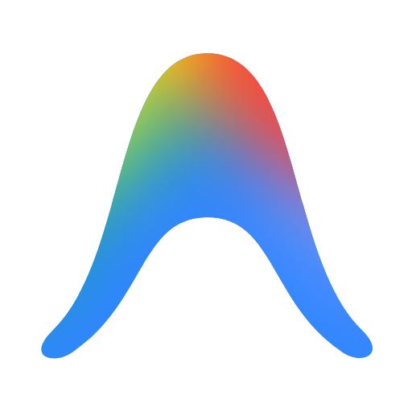

# Antigravity for Home Assistant

Run the Google Antigravity agent on your Home Assistant host and drive it from
https://antigravity.google.com via Remote Control. Includes the ha-mcp
Home Assistant MCP server.

See the **Documentation** tab for setup instructions.
